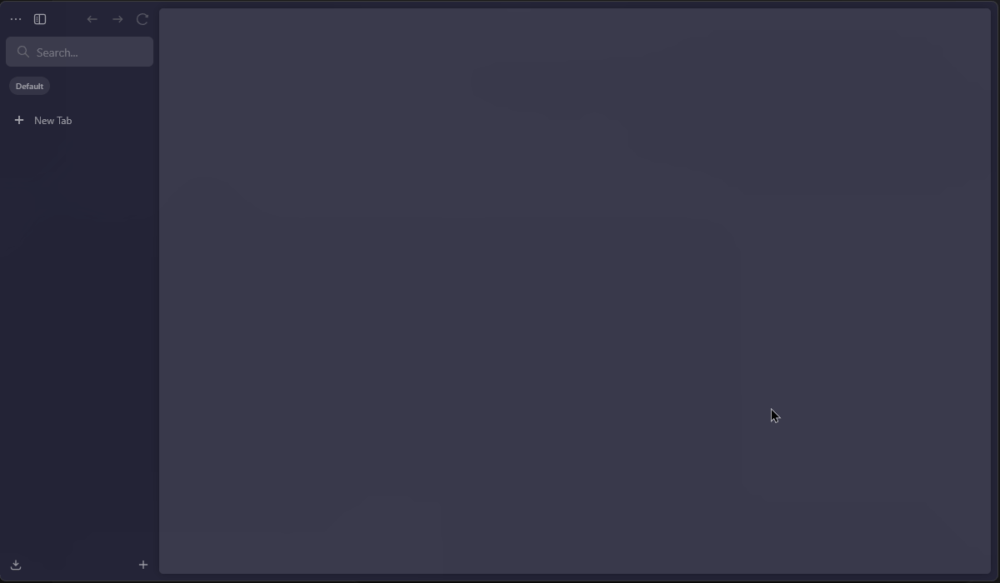

# webhook-tester



Webhook Tester is a lightweight Go service for receiving webhook requests locally and inspecting them in real time from a browser UI.

## Overview

The current codebase provides:

- `GET /health` for a basic health check
- `POST /hooks` for receiving webhook payloads
- `GET /hooks` for the HTML UI
- `GET /hooks/events` for SSE realtime updates
- `GET /hooks/data` for JSON history of captured requests
- In-memory storage for request history and connected SSE clients

More details are in [docs/overview.md](docs/overview.md).

## How It Works

1. Start the Go server on `localhost:8080`.
2. Expose it publicly with ngrok.
3. Point a webhook provider at the public URL.
4. Incoming requests are forwarded to `/hooks`.
5. The server stores the request in memory.
6. Connected browsers receive the webhook instantly via SSE.

## Requirements

- Go 1.26 or newer
- ngrok, if you want to receive requests from external services

## Run

Start the server directly:

```bash
go run server/main.go
```

Or use the dev helper that starts the server and ngrok together:

```bash
task dev
```

On Windows, the helper uses `scripts/dev.ps1`. On Linux and macOS, it uses `scripts/dev.sh`.

## Endpoints

| Method | Path          | Description                                |
| ------ | ------------- | ------------------------------------------ |
| GET    | /health       | Returns `200 OK`                           |
| GET    | /hooks        | Serves the web UI                          |
| POST   | /hooks        | Receives and stores the webhook in memory  |
| GET    | /hooks/data   | Returns webhook history as JSON            |
| GET    | /hooks/events | SSE stream with snapshot + realtime events |

## Example

```bash
curl -X POST http://localhost:8080/hooks \
  -H "Content-Type: application/json" \
  -d '{"event":"test","value":123}'
```

The request is accepted with `200 OK`.

## Project Structure

```text
webhook-tester/
├── handler/        request handling logic
├── request/        webhook request model
├── server/         HTTP server entry point
├── store/          in-memory request storage
└── scripts/        local development helpers
```

## Non-Goals

- No database
- No authentication
- No persistence across restarts
- No request replay
- No multi-tenant session isolation

## Roadmap

The overview in [docs/overview.md](docs/overview.md) describes the intended next steps:

- Request filtering and search
- Optional payload size limits and retention policies
- Better dev ergonomics around public URL discovery
